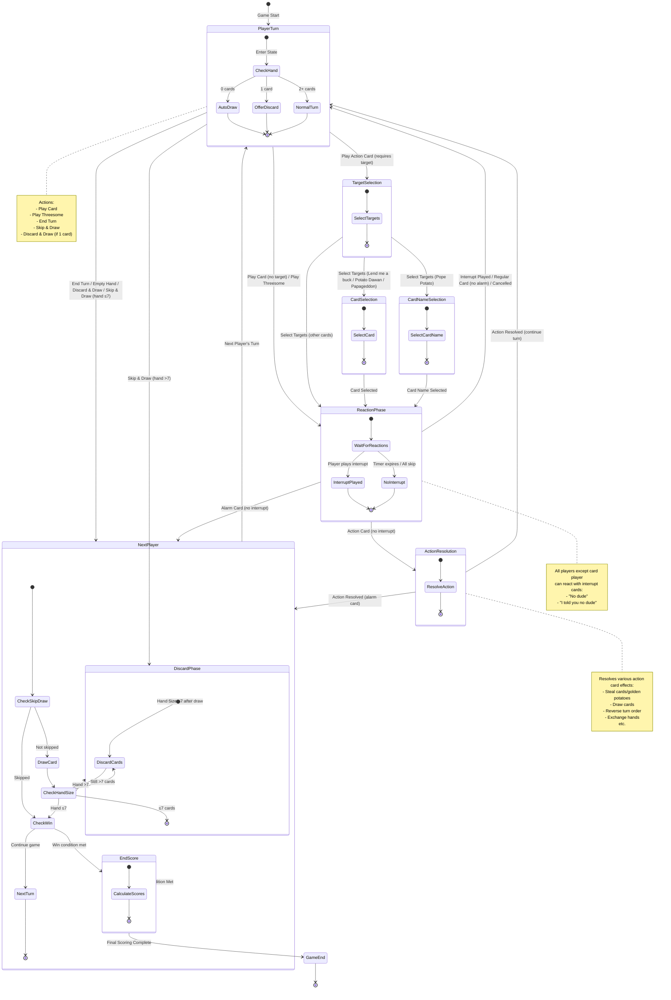

# Game State Machine Diagram

## State Descriptions

### PlayerTurn (ID: 2)
- **Type**: ACTIVE_PLAYER
- **Description**: Active player's turn to play cards or take actions
- **Transitions**:
  - → NextPlayer: End turn, empty hand auto-draw, skip & draw (hand ≤7)
  - → ReactionPhase: Play card (no target) or play threesome
  - → TargetSelection: Play action card requiring target
  - → DiscardPhase: Skip & draw results in hand >7

### ReactionPhase (ID: 20)
- **Type**: MULTIPLE_ACTIVE_PLAYER
- **Description**: All players (except card player) can react with interrupt cards
- **Transitions**:
  - → PlayerTurn: Interrupt played, regular card (no alarm), or cancelled
  - → ActionResolution: Action card played (no interrupt)
  - → NextPlayer: Alarm card played (no interrupt)

### TargetSelection (ID: 25)
- **Type**: ACTIVE_PLAYER
- **Description**: Select target(s) for action card
- **Transitions**:
  - → CardSelection: Cards requiring card selection (Lend me a buck, Potato Dawan, Papageddon)
  - → CardNameSelection: Pope Potato (requires naming a card)
  - → ReactionPhase: Other action cards

### CardSelection (ID: 26)
- **Type**: ACTIVE_PLAYER
- **Description**: Select a card from target's hand (blind selection)
- **Transitions**:
  - → ReactionPhase: Card selected

### CardNameSelection (ID: 28)
- **Type**: ACTIVE_PLAYER
- **Description**: Name a card type (for Pope Potato)
- **Transitions**:
  - → ReactionPhase: Card name selected

### ActionResolution (ID: 27)
- **Type**: GAME
- **Description**: Resolve the effect of an action card
- **Transitions**:
  - → PlayerTurn: Action resolved (continue turn)
  - → NextPlayer: Action resolved (alarm card ends turn)

### DiscardPhase (ID: 30)
- **Type**: ACTIVE_PLAYER
- **Description**: Discard cards down to 7 or fewer
- **Transitions**:
  - → NextPlayer: Hand size ≤7

### NextPlayer (ID: 90)
- **Type**: GAME
- **Description**: Transition between turns, handle end-of-turn draw, check win conditions
- **Transitions**:
  - → PlayerTurn: Next player's turn
  - → DiscardPhase: Hand size >7 after draw
  - → EndScore: Win condition met (golden potatoes threshold reached)

### EndScore (ID: 98)
- **Type**: GAME
- **Description**: Final scoring and game end
- **Transitions**:
  - → ST_END_GAME (99): Game ends

## Key Game Flow Paths

1. **Normal Turn Flow**:
   PlayerTurn → (Play Card) → ReactionPhase → (No Interrupt) → PlayerTurn / NextPlayer / ActionResolution

2. **Action Card with Target Flow**:
   PlayerTurn → TargetSelection → (CardSelection/CardNameSelection) → ReactionPhase → ActionResolution → PlayerTurn / NextPlayer

3. **Threesome Flow**:
   PlayerTurn → (Play Threesome) → ReactionPhase → (No Interrupt) → PlayerTurn

4. **Hand Size Management Flow**:
   PlayerTurn → (Skip & Draw) → DiscardPhase → NextPlayer

5. **End Game Flow**:
   NextPlayer → (Win Condition) → EndScore → GameEnd
